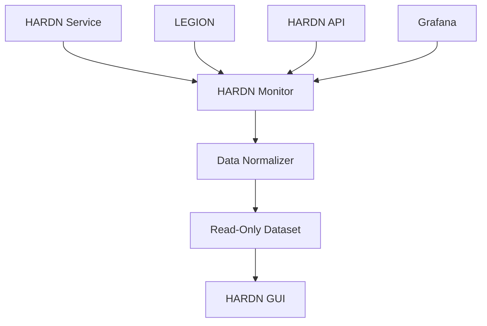
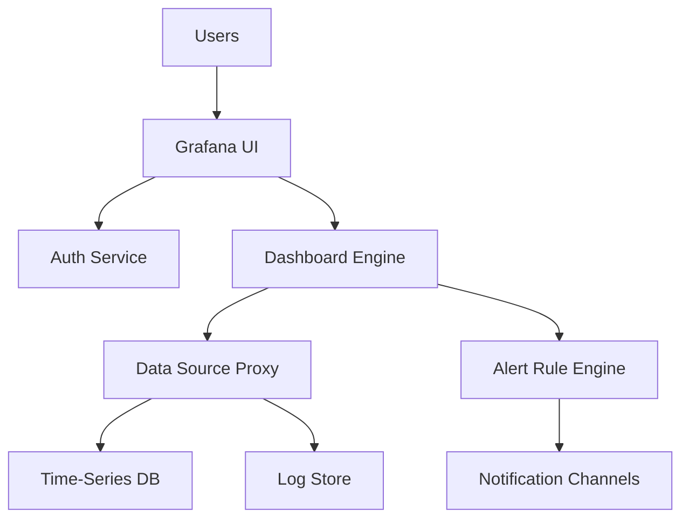

# Design Architectures (Demo)

## LEGION
- the mermaid architecture of legion daemon, api, monitor and all services
- LEGION interacts with Linux backend services such as systemd for service lifecycle management (e.g., starting/stopping services), network manager for network configuration and monitoring, systemctl for system control commands, and other services like journald for logging, udev for device events, and cron for scheduled tasks. The Monitor Service captures metrics and events from these, while the LEGION API can issue commands or queries to them for automation and control.

```mermaid
graph TD
    A[Client] --> B[LEGION API]
    B --> C[Monitor Service]
    C --> D[Logging Service]
    C --> E[Alert Service]
    B --> F[Data Processor]
    F --> G[Database]
    F --> H[Cache]
    C --> I[systemd]
    C --> J[Network Manager]
    C --> K[systemctl]
    C --> L[Other Linux Services<br/>(e.g., journald, udev, cron)]
    B --> M[systemd Commands]
    B --> N[Network Manager Queries]
```

## HARDN
- the mermaid architecture of hardn. api. monitor and all services
- HARDN interacts with Linux backend services such as systemd for service lifecycle management (e.g., starting/stopping services), network manager for network configuration and monitoring, systemctl for system control commands, and other services like journald for logging, udev for device events, and cron for scheduled tasks. The Monitor Service captures metrics and events from these, while the HARDN API can issue commands or queries to them for automation and control.

```mermaid
graph TD
    A[Client] --> B[HARDN API]
    B --> C[Monitor Service]
    C --> D[Logging Service]
    C --> E[Alert Service]
    B --> F[Data Processor]
    F --> G[Database]
    F --> H[Cache]
    C --> I[systemd]
    C --> J[Network Manager]
    C --> K[systemctl]
    C --> L[Other Linux Services<br/>(e.g., journald, udev, cron)]
    B --> M[systemd Commands]
    B --> N[Network Manager Queries]
```

## HARDN Monitor
- the mermaid architecture of the HARDN Monitor detailing how it gathers data from in-cluster services and supplies read-only outputs to the GUI.
- HARDN Monitor aggregates operational data from HARDN Service, LEGION, HARDN API, and Grafana, normalizes it into read-only datasets, and exposes those to the GUI without any Prometheus integration.



## Grafana
- the mermaid architecture of Grafana showing user access, data source proxying, dashboard rendering, and alert evaluation.
- Grafana authenticates users, retrieves data from monitored sources such as the HARDN Monitor and Logging Store, renders dashboards, and runs alert rules that publish notifications.


