# HARDN Security Service – Full Architecture Overview

```mermaid
graph TD

%% ===================== ENTRYPOINTS =====================
U[User / Admin / GUI] -->|commands & monitoring| API[HARDN API Service]
CLI[hardn CLI] -->|manual execution| CORE[HARDN Core Service]
API -->|remote trigger| CORE

%% ===================== SERVICE COMPONENTS =====================
subgraph HARDN Core Framework
  direction TB
  MOD[Hardening Modules]
  TOOLS[Security Tools Layer]
  CFG[Configuration Engine]
  AUD[Audit and Compliance Engine]
  LOG[System Logger]
  RPT[Security Report Generator]

  CORE --> MOD
  CORE --> TOOLS
  CORE --> CFG
  CORE --> AUD
  CORE --> LOG
  CORE --> RPT
end

subgraph HARDN API Layer
  direction TB
  SRV[REST API Server]
  MON[Monitoring Endpoints]
  AUTH[Authentication Manager]
  DATA[Data Aggregator]
  SRV --> MON
  SRV --> AUTH
  SRV --> DATA
end

%% ===================== SECURITY TOOL INTEGRATIONS =====================
subgraph Security Tools
  direction TB
  APP[AppArmor - Access Control]
  F2B[Fail2Ban - Intrusion Prevention]
  UFW[UFW - Firewall]
  AUDD[Auditd - System Auditing]
  CLAM[ClamAV - Antivirus]
  RKH[rkhunter - Rootkit Detection]
  LYN[Lynis - Security Auditing]
  AIDE[AIDE - File Integrity Monitor]
  TOOLS --> APP
  TOOLS --> F2B
  TOOLS --> UFW
  TOOLS --> AUDD
  TOOLS --> CLAM
  TOOLS --> RKH
  TOOLS --> LYN
  TOOLS --> AIDE
end

%% ===================== SYSTEM SERVICES =====================
subgraph Linux Services
  direction TB
  SYSMD[systemd]
  JRN[journald]
  CRN[cron]
  NETM[NetworkManager]
end

CORE --> SYSMD
CORE --> JRN
CORE --> CRN
API --> JRN
API --> NETM

%% ===================== DATA FLOWS =====================
U -->|status / reports| API
API -->|invoke hardening / scan| CORE
CORE -->|telemetry / logs| API
LOG -->|journal logs| JRN
AUD -->|compliance reports| RPT
RPT -->|security score & findings| API

%% ===================== CLASSES =====================
classDef entry fill:#f0f4ff,stroke:#3b82f6,color:#1e3a8a;
classDef daemon fill:#fef9c3,stroke:#ca8a04,color:#713f12;
classDef layer fill:#ecfccb,stroke:#84cc16,color:#365314;
classDef tools fill:#e0f2fe,stroke:#0284c7,color:#0c4a6e;
classDef os fill:#f9fafb,stroke:#9ca3af,color:#374151,stroke-dasharray:3 3;

class U,API,CLI entry
class CORE,SRV daemon
class MOD,TOOLS,CFG,AUD,LOG,RPT,MON,AUTH,DATA layer
class APP,F2B,UFW,AUDD,CLAM,RKH,LYN,AIDE tools
class SYSMD,JRN,CRN,NETM os
```

---

### Architecture Summary

| Component | Role |
|------------|------|
| **HARDN Core Service** | Executes system-wide security hardening modules and configuration routines. |
| **HARDN API Service** | REST API providing remote control, status queries, and security telemetry aggregation. |
| **Hardening Modules** | Individual system-hardening scripts enforcing STIG/CIS standards. |
| **Security Tools Layer** | Integrates AppArmor, Fail2Ban, UFW, Auditd, ClamAV, Lynis, rkhunter, and AIDE under one orchestration layer. |
| **Audit & Compliance Engine** | Ensures continuous monitoring and reporting against NIST/STIG benchmarks. |
| **Configuration Engine** | Manages service policies, kernel parameters, and system-level security defaults. |
| **System Logger** | Centralized structured journaling for all modules and API events. |
| **Security Report Generator** | Produces human-readable and machine-readable summaries for audits. |
| **Linux Services Integration** | Uses systemd for orchestration, journald for logging, cron for scheduling, and NetworkManager for connectivity. |

---