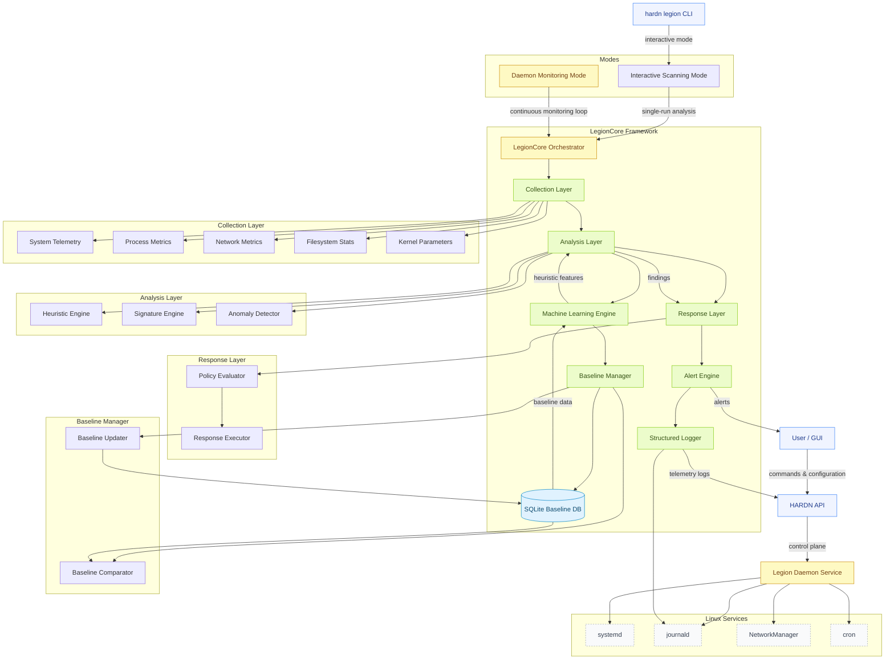

# HARDN Legion Daemon – Full Architecture (with SQLite Baseline System)

---

### Architecture Summary

| Component | Role |
|------------|------|
| **Collection Layer** | Sequential collectors (system, process, network, filesystem, kernel) feed telemetry into the analysis stack. |
| **Analysis Layer** | Pure-Rust heuristic, signature, and ML-based anomaly detection engines operate on immutable telemetry batches. |
| **Response Layer** | Applies deterministic policy rules (alert, isolate, block) with cooldown and audit guarantees. |
| **Baseline Manager** | Handles baseline comparison and update cycles; persists all states in **SQLite** under `/var/lib/hardn/legion/legion.db`. |
| **SQLite Baseline DB** | The heuristics backbone — stores normalized telemetry, learned baselines, historical risk scores, and ML training data. |
| **Machine Learning Engine** | Uses SQLite data to train, cluster, and evaluate anomaly patterns in real-time. |
| **Logging & Alerts** | Unified journal logging and structured alert output via `systemd-journal`. |
| **Integration Services** | systemd, journald, cron, and NetworkManager used for lifecycle, logging, and telemetry scheduling. |

---